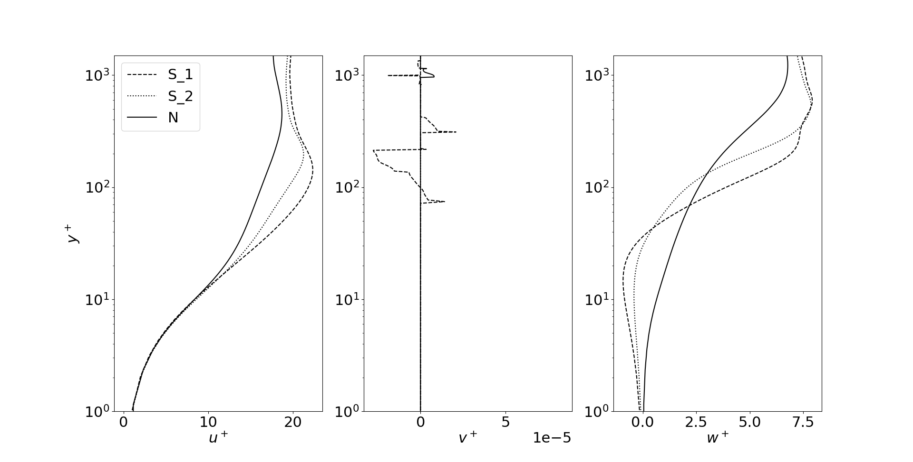

# Simulation of slender vortex filaments

This page has been setup to support the preprint __*On the motion of hairpin filaments in the atmospheric boundary layer*__ which can be found in arXiv: https://arxiv.org/abs/2303.09302.

Please note that this page is currently __under construction__ and the codes will be uploaded over time.

# Velocity profiles

The velocity profiles have been uploaded for three Ekman flow cases: N, S_1, S_2. Case N corresponds to a neutrally stratified case and cases S_1 and S_2 are the stably stratified cases. Details of the simulation can be found in the preprint, Ansorge and Mellado (2014, 2016) and the PhD thesis of Ansorge (2016).

