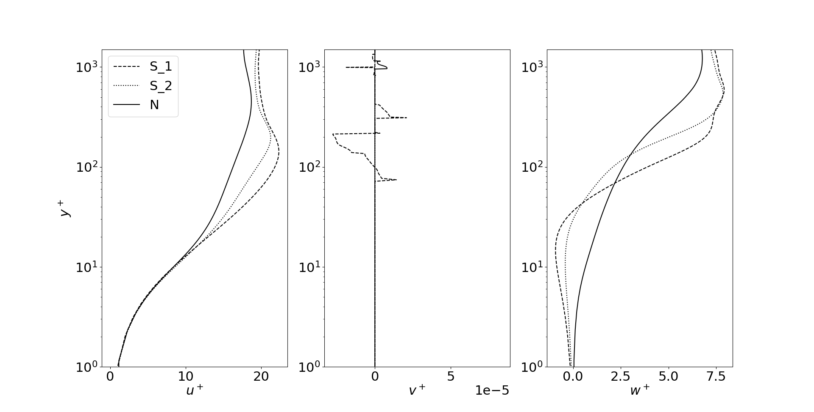

# Simulation of slender vortex filaments

This page has been setup to support the preprint __*On the motion of hairpin filaments in the atmospheric boundary layer*__ which can be found in arXiv: https://arxiv.org/abs/2303.09302.

Please note that this page is currently __under construction__ and the codes will be uploaded over time.

## Velocity profiles

The velocity profiles have been uploaded for three Ekman flow cases: N, S_1, S_2. Case N corresponds to a neutrally stratified case and cases S_1 and S_2 are the stably stratified cases. Details of the simulation can be found in the preprint, Ansorge and Mellado (2014, 2016) and the PhD thesis of Ansorge (2016).

```
python3 plotProfiles.py
```



## Slender vortex filament code

* This code computes the motion of slender vortex filaments with two methods: Local induction approximation (LIA) and the M1 Klein-Knio (M1 KK) scheme. Details of both methods can be found in the preprint.
* It is based on the ezvortex code, written in C, by Daniel Margerit. See the original C code and the corresponding publications here: https://github.com/danielmargerit/ezvortex.

## Additional references

Ansorge, C., & Mellado, J. P. (2014). Global intermittency and collapsing turbulence in the stratified planetary boundary layer. Boundary-layer meteorology, 153(1), 89-116.

Ansorge, C., & Mellado, J. P. (2016). Analyses of external and global intermittency in the logarithmic layer of Ekman flow. Journal of Fluid Mechanics, 805, 611-635.

Ansorge, C. (2016). Analyses of turbulence in the neutrally and stably stratified planetary boundary layer. Springer.
