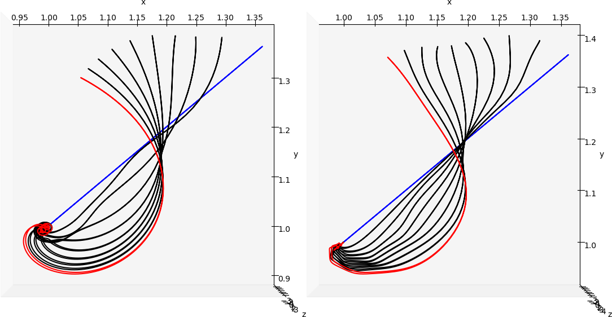

# Simulation of slender vortex filaments

This page has been setup to support the preprint __*On the motion of hairpin filaments in the atmospheric boundary layer*__ which can be found in arXiv: https://arxiv.org/abs/2303.09302.

Please note that this page is currently __under construction__ and the codes will be uploaded over time.

## Velocity profiles

The velocity profiles have been uploaded with the permission of Dr. Cedrick Ansorge for three Ekman flow cases: N, S_1, S_2. Case N corresponds to a neutrally stratified case and cases S_1 and S_2 are the stably stratified cases. Details of the simulation can be found in the preprint, Ansorge and Mellado (2014, 2016) and the PhD thesis of Ansorge (2016). The code used for the simulation can be found here: https://github.com/turbulencia/tlab. 

```
python3 plotProfiles.py
```


## Slender vortex filament code

* This code computes the motion of slender vortex filaments with two methods: Local induction approximation (LIA) and the M1 Klein-Knio (M1 KK) scheme. Details of both methods can be found in the preprint.
* It is based on the ezvortex code, written in C, by Dr. Daniel Margerit. See the original C code and the corresponding publications here: https://github.com/danielmargerit/ezvortex.

### Setting up the code
The code can run in four modes,
- full python mode
- python with numba library (for details regarding the library, see https://numba.pydata.org/)
- partial FORTRAN (only for computing the thin tube velocity in M1 KK method, time integration is handled by python)
- full FORTRAN (only for M1 KK method, python simply acts as a wrapper in this scenario)

To compile FORTRAN code, run the following:
```
cd src/partial_fortran/
make
cd ../full_fortran/
make
```
### Stagnant background flow

An example python template for a stagnant background flow is given. Comments have been added to explain the various parameters and flags. By default, it runs the LIA method in python with numba mode.

### Performance

The following is tested for the stagnant background flow case given in the template.<br />
For LIA, ts = 0.00001, nsteps = 1000, writeEveryNSteps = 100<br />
For M1 KK, ts = 0.001, nsteps = 10, writeEveryNSteps = 1<br />

At t = 0.01, the temporal evolution of the hairpin filament for LIA (left) and M1 KK (right),<br />


| Method  | Mode | Number of nodes | Time taken (s) |
|:-------------:|:-------------:|:-------------:|:-------------:|
| LIA | full python  | 700 | 45.264 |
| | python with numba | 700 | 23.04 |
| | full python | 900 | 60.86 |
| | python with numba | 900 | 26.81 |
| M1 KK | python with numba  | 900 | 95.547 |
| | partial FORTRAN | 900 | 38.497 |
| | full FORTRAN | 900 | 6.179 | 

### Difference between LIA and M1 KK methods

At t = 0.1, the temporal evolution of the hairpin filament for LIA (left) and M1 KK (right),<br />


### Pending work
- Wall impermeability is not fully supported yet. It works in FORTRAN only.
- Addition of more python template files for simple shear flow and boundary layer flow.

## Additional references

Ansorge, C., & Mellado, J. P. (2014). Global intermittency and collapsing turbulence in the stratified planetary boundary layer. Boundary-layer meteorology, 153(1), 89-116.

Ansorge, C., & Mellado, J. P. (2016). Analyses of external and global intermittency in the logarithmic layer of Ekman flow. Journal of Fluid Mechanics, 805, 611-635.

Ansorge, C. (2016). Analyses of turbulence in the neutrally and stably stratified planetary boundary layer. Springer.
